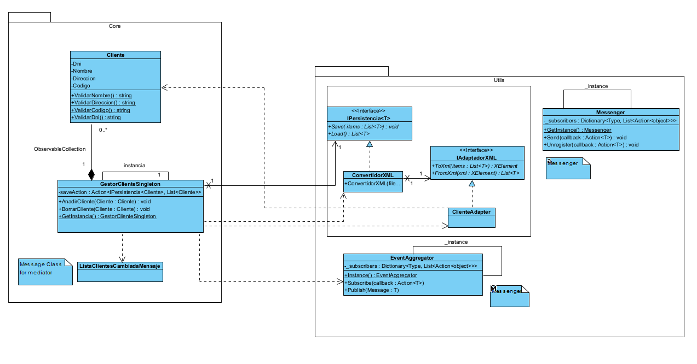

# Project Overview
This project follows the **MVVM (Model-View-ViewModel)** architecture to separate concerns and maintain a scalable and clean structure. It includes a persistence mechanism, singleton view management, and an event-driven communication system.

## Architecture

### Model
The **Model** layer contains the application's data and business logic. It includes:
- **Cliente class**: Represents the client data.
- **GestorClienteSingleton**: Manages the client list using the Singleton pattern.

### ViewModel
The **ViewModel** acts as the bridge between the **Model** and the **View**. It follows the **Command** pattern and uses the **Observer** pattern to notify the view of any data changes. Commands (implemented using `RelayCommand`) are triggered by user actions in the view, allowing decoupled interaction with the model.

### Utils

- **IPersistencia**: Interface for persistence operations, implemented by **ConvertidorXML**.
- **ConvertidorXML**: Responsible for saving and loading data in XML format, leveraging the flexibility of the **IPersistencia** interface.
- **ClienteAdapter**: Implements **IAdaptadorXML** to convert a client list to and from XML, ensuring bidirectional transformation between data and XML format.
- **VistaSingleton**: Ensures only one instance of each view is created, providing a singleton pattern for the views (excluding the main view).
- **EventAggregator**: A mediator that facilitates communication between components, allowing for event subscription and publication (used for client list updates).
- **Messenger**: A decoupled communication tool used to pass information between objects without direct dependency.

### View
The **View** layer is responsible for presenting the user interface. It binds to properties and commands exposed by the **ViewModel** to reflect changes and trigger actions.

## How It Works

### Single View Instance
Views are managed through **VistaSingleton**, ensuring that only one instance of each view (except for the main view) exists.

### Data Persistence
The **ConvertidorXML** handles saving and loading client data to and from XML, using **IAdaptadorXML** for bidirectional conversion.

### Event-Driven Communication
**EventAggregator** allows components to communicate asynchronously without tight coupling, while **Messenger** ensures that information can be passed between components.

### Command Pattern
The **ViewModel** uses commands (**RelayCommand**) to bind UI actions to business logic, following the **Observer** pattern to update the view when the data changes.

## Diagram class MODEL-UTILS

